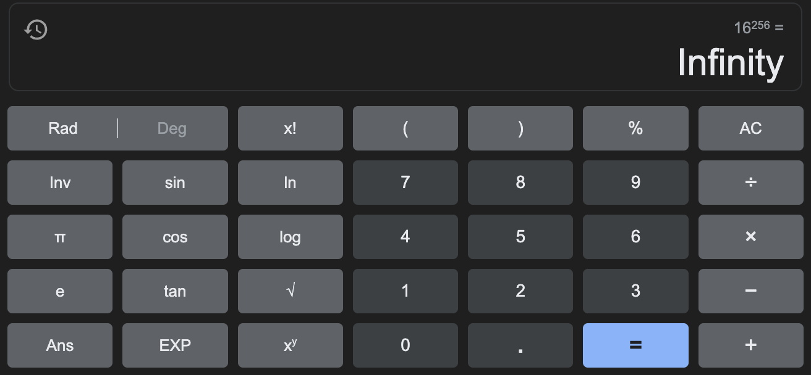

## This repo follows the Quick Sudoku Solver series on Medium.

### Read the articles:
- [Part 1:](https://medium.com/@spooky_man/quick-sudoku-solver-pt-1-eb9a748e3e7a) Laying the groundwork

Some thing to look into:
- Shaving
- System Verilog Constraint
- https://ai.dmi.unibas.ch/_files/teaching/fs13/ki/material/ki10-sudoku-inference.pdf
- https://www.dbai.tuwien.ac.at/research/project/arte/sudoku/paper.pdf
- https://info.bb-ai.net/student_projects/project_reports/Henry-Davies-Killer-Sudoku.pdf
- hill climbing solutions

Things to talk about in the next article:
1. optimised generator
  - beforehand, the generator had an average of 36 empty squares and a standard deviation of about 8
  - now the generator produces sudokus with an average of 55 squares with a standard deviation of <1
  - is a lot slower
    - before (100 runs)
      - mean gen time: 0.02375178098678589
      - stdev gen time: 0.039746322263617254
      - mean empty squares: 35.28
      - stdev empty squares: 9.490111812946266
    - after (10 runs):
      - mean gen time: 3.1263929128646852
      - stdev gen time: 4.8535482937463215
      - mean empty squares: 53.6
      - stdev empty squares: 1.4298407059684815
  - change: don't return sudoku  immediately when it removes a square which results in duplicate solution; instead just go on to the next square
  - theres a tradeoff between harder sudoku and time generating sudokus
  one example of a sudoku generated with first algorithm:
  - 2 0 8 4 7 3 6 9 1
    0 7 9 6 0 1 4 2 5
    1 6 4 5 2 9 7 8 3
    4 1 3 8 5 2 9 7 6
    8 9 5 7 1 6 2 0 0
    6 2 7 9 3 4 0 1 8
    9 3 1 2 6 5 0 4 7
    7 4 6 3 9 0 1 5 2
    5 0 2 0 0 7 0 6 9
    (almost all non-zero)
2. Results:
 - solved 19 hard (newer alg) 3x3 sudokus:
   - mean : 0.13218548423365542
   - stdev: 0.18745729546020534
3. 4x4
 - estimated time:
 - 3x3:
   - crude: 9^81 = 1.9662705e+77
   - not checking everything: (9!)*9 = 3265920
   - took: 0.13218548423365542s
 - 4x4:
   - crude: 16^256 = infinity
   - 
   - optimised: 16!*16 = 3.3476464e+14
   - estimated time: 3.3476464e+14 / 3265920 = 102502400; 102502400 * 0.13218548423365542s = 13549279.744s = 225821.329067 min = 3763.68881778 hrs = 156.8 days - about half a year
   - hell nah i ain't running that
 
5. Gen stats:
    1. sudoku stats - 10 sudokus
        mean : 24.9
        stdev: 0.8755950357709131
        min: 23
        max: 26
    timing
        mean : 29.562716817855836
        stdev: 50.0318000015308
        min: 0.7941467761993408
        max: 162.52223896980286
   2. timing - 2 sudokus
      mean : 17.30071496963501
      stdev: 19.279308778665577
      min: 3.668184995651245
      max: 30.933244943618774
   sudoku stats
      mean : 24.5
      stdev: 0.7071067811865476
      min: 24
      max: 25

6. Solve times
   1. solve time - 17 sudokus
   mean : 1.4534573835485123
   stdev: 2.345127496684347
   min: 0.016819000244140625
   max: 8.869170904159546
   sudoku stats
      mean : 24.58823529411765
      stdev: 0.8702602720890289
      min: 23
      max: 26
   2. (same sudokus as above)
      solve time
      mean : 1.4419501108281754
      stdev: 2.340501475481897
      min: 0.01682901382446289
      max: 8.835848808288574
   3. (same sudokus as above - strategy opt1_backtracking)
      solve time
      mean : 1.2553241813884062
      stdev: 2.039558410704091
      min: 0.014966011047363281
      max: 7.746784210205078
   4. (same sudokus as above - strategy opt2_backtracking)
      solve time
      mean : 0.7722078631905949
      stdev: 1.152763555029625
      min: 0.0034961700439453125
      max: 3.7731308937072754
   5. (same sudokus as above - strategy opt3_backtracking)
      solve time
      mean : 1.3678127737606274
      stdev: 2.002610364594994
      min: 0.0058748722076416016
      max: 5.951871871948242
   6. (same sudokus as above - strategy opt4 backtracking)
      solve time
      mean : 0.32778655781465416
      stdev: 0.5048844873256506
      min: 0.0005040168762207031
      max: 2.0134997367858887
   7. (same sudokus as above - strategy opt5 backtracking)
      solve time
      mean : 0.1870243268854478
      stdev: 0.3008836896620631
      min: 0.0022962093353271484
      max: 1.1460742950439453
   8. (same sudokus as above - strategy constraint1)
      solve time
      mean : 0.21983211180743048
      stdev: 0.23963808119395993
      min: 0.06774783134460449
      max: 1.0454318523406982
   9. (same sudokus as above - strategy constraint1 w functools cache on generating arcs)
      solve time
      mean : 0.14598320512210622
      stdev: 0.15829271531627834
      min: 0.04480791091918945
      max: 0.6900060176849365
   10. (same sudokus as above - strategy constraint2)
       solve time
       mean : 0.12935679099139044
       stdev: 0.1423737120913063
       min: 0.038826942443847656
       max: 0.6148250102996826
   11. same sudokus as above - strategy constraint3
       solve time
       mean : 0.1298680024988511
       stdev: 0.14318545897717835
       min: 0.03872179985046387
       max: 0.6147561073303223
   12. same sudokus - strategy constraint4
       solve time
       mean : 0.13104797812069163
       stdev: 0.14200930780334975
       min: 0.041532039642333984
       max: 0.6081840991973877
7. Standard AC3
 - How many arcs in a 3x3 sudoku?
 - each square has 8 + 6 + 6 = 20 arcs
 - 81 * 20 = 1620 arcs total
 - Initial run: Ran for 4hrs 25 min and didn't solve (it was bugged)
 - Next run is run 8 from above section - really quite good